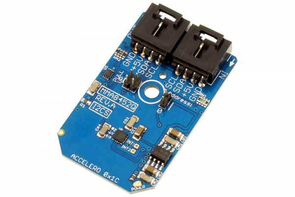

# MMA8452Q

Manufactured by Freescale Semiconductor, Inc., the MMA8452Q is a smart, low-power, three-axis, capacitive, micro-machined accelerometer with 12 bits of resolution.
This Device is available from www.ncd.io 

[SKU: MMA8452Q_I2CS]

(https://store.ncd.io/product/mma8452q-3-axis-12-bit8-bit-digital-accelerometer-i2c-mini-module/)
This Sample code can be used with Arduino.

Hardware needed to interface MMA8452Q sensor with Arduino

1. <a href="https://store.ncd.io/product/i2c-shield-for-arduino-nano/">Arduino Nano</a>

2. <a href="https://store.ncd.io/product/i2c-shield-for-arduino-micro-with-i2c-expansion-port/">Arduino Micro</a>

3. <a href="https://store.ncd.io/product/i2c-shield-for-arduino-uno/">Arduino uno</a>

4. <a href="https://store.ncd.io/product/dual-i2c-shield-for-arduino-due-with-modular-communications-interface/">Arduino Due</a>

5. <a href="https://store.ncd.io/product/mma8452q-3-axis-12-bit8-bit-digital-accelerometer-i2c-mini-module/">MMA8452Q 3Axis Accelometer sensor</a>

6. <a href="https://store.ncd.io/product/i%C2%B2c-cable/">I2C Cable</a>

MMA8452Q:

Manufactured by Freescale Semiconductor, Inc., the MMA8452Q is a smart, low-power, three-axis, capacitive, micro-machined accelerometer with 12 bits of resolution.

Applications:

• E-compass applications

• Static orientation detection (portrait/landscape, up/down, left/right, back/front position identification)

• Notebook, e-reader, and laptop tumble and freefall detection

• Real-time orientation detection (virtual reality and gaming 3D user position feedback)

• Real-time activity analysis (pedometer step counting, freefall drop detection for HDD, dead-reckoning GPS backup)

• Motion detection for portable product power saving (auto-sleep and auto-wake for cell phone, PDA, GPS, gaming)

How to Use the MMA8452Q Arduino Library

The MMA8452Q has a number of settings, which can be configured based on user requirements.
          
1.Output range selection:The following command is used to set the output range of MMA8452Q sensor.

              mma.setAccelRange(ACCEL_RANGE_2G);                  // 2 g
            
2.Bandwidth selection:The following command is used to select the bandwidth of accelometer.

             mma.setAccelBandwidth(ACCEL_BANDWIDTH_800HZ);       // ODR: 800 Hz, Period: 1.25 ms
